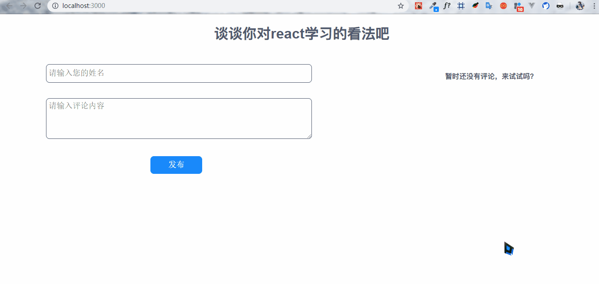

# react-app

## Introduction

> 简单的练习一下react，对比vue学习。

## Project setup

### Clone Project

```bash
$ git clone https://github.com/bigbigDreamer/react-app
```

### Install dependences

```bash
$ npm i 
```

### Run

```bash
$ npm start
```
## Effect

